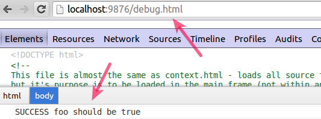

# Karma - Test Runner for Javascript

[Maksim Ryzhikov](https://plus.google.com/+MaksimRyzhikov)

!SLIDE #Cover

<h2 class="subject">
    <center>
        Karma - Test Runner for Javascript
    </center>
</h2>

!SLIDE shout

## Качество & Продуктивность

!SLIDE

## TDD - Test Driven Development

Ингредиенты успешного TDD

- Тестируемый код → [AngularJS](http://angularjs.org/)
- Удобное тестовое окружение → [Karma](http://karma-runner.github.io/0.12/index.html)

!SLIDE

## Тестовое окружение

- Инструмент для запуска тестов → [Karma](http://karma-runner.github.io/0.12/index.html)
- Framework для написания тестов → [Mocha](http://visionmedia.github.io/mocha/)
- Библиотека Assertion`ов → [Expect.js](https://github.com/LearnBoost/expect.js)

!SLIDE

## Karma main goal

> The @@main goal for Karma is to bring a productive testing environment to developers@@.
The environment being one where they don`t have to set up loads of configurations, but rather a place where developers can @@just write the code and get instant feedback from their tests@@. Because getting quick feedback is what makes you productive and creative.

!SLIDE

## [Установка и настройка](http://karma-runner.github.io/0.12/intro/configuration.html)

```sh
npm install -g karma-cli
@@npm install karma # Install Karma@@

karma init # Create configuration file

@@npm install karma-mocha # Testing framework@@
@@npm install karma-expect # Assertion lib@@
@@npm install karma-phantomjs-launcher # Browser@@
```

!SLIDE small-text

## Запуск (Client-Server)

```sh
karma @@@start@@@

INFO [karma]: Karma v0.12.0 server started at @@http://localhost:9876/@@
INFO [launcher]: Starting browser PhantomJS
INFO [PhantomJS 1.9.7 (Linux)]: Connected on socket M64_IXz with id 98199717
PhantomJS 1.9.7 (Linux): Executed 1 of 1 SUCCESS (@@0.011 secs@@ / 0.003 secs)
```

!SLIDE small-text

## [Базовая настройка karma.conf.js](http://karma-runner.github.io/0.12/config/configuration-file.html)

```json
module.exports = function(config) {
    config.set({
        @@@frameworks:@@@ ['mocha', 'expect'],
        files: @@['test/**/*.js']@@,
        autoWatch: @@false@@,
        singleRun: @@true@@,
        @@@browsers@@@: ['PhantomJS']
    });
}
```

!SLIDE small-text

## Watch & Fast tests

```sh
    karma start @@@--single-run=false --auto-watch=true@@@
    ...
    PhantomJS 1.9.7 (Linux): Executed 1 of 1 SUCCESS (0.038 secs / 0.005 secs)
    @@INFO [watcher]: Changed file "/tmp/karma/test/foo_spec.js".@@
    PhantomJS 1.9.7 (Linux): Executed 2 of 2 SUCCESS @@(0.037 secs / 0.006 secs)@@
    ...
```
<center>
    <p class="note">
        ➜  Изменил файл ➜  Тесты  ➜  Изменил файл ➜  Тесты ... ➜
    </p>
</center>

!SLIDE small-text

## [Выходя за рамки стандартного](http://karma-runner.github.io/0.12/config/preprocessors.html)

```json
module.exports = function(config) {
    config.set({
        files: @@['src/**/*.js', 'test/*.coffee', 'lib/*.dart']@@,
        @@@preprocessors@@@: {
            '**/*.js': ['borschik'],
            '**/*.coffee': @@['coffee']@@,
            '**/*.dart': ['dart']
        }
    });
}
```

!SLIDE small-text

## Karma уже умеет тестировать:

 + ✔ AngularJS
 + ✔ [Traceur](https://github.com/karma-runner/karma-traceur-preprocessor)
 + ✔ [Ember](https://github.com/karma-runner/karma-ember-preprocessor)
 + ✔ [html2js](https://github.com/karma-runner/karma-html2js-preprocessor)
 + ✔ [Dart](https://github.com/karma-runner/karma-dart)
 + ✔ [Require.js](https://github.com/karma-runner/karma-requirejs)
 + ✔ [commonjs](https://github.com/karma-runner/karma-commonjs)
 + ✔ [closure](https://github.com/karma-runner/karma-closure)
 + ✔ [Dojo](https://github.com/karma-runner/karma-dojo)

... и это @@только часть plugin`ов@@

!SLIDE shout

## [Any Browsers, Devices, OS](http://karma-runner.github.io/0.12/config/configuration-file.html)

!SLIDE small-text

Просто зайдите на host где запущен @@karma-server@@


```sh
Karma v0.12.0 server started at @@http://localhost:9876/@@
...
PhantomJS 1.9.7 (Linux): Executed 2 of 2 SUCCESS (0.03 secs / 0.009 secs)
Chromium 31.0.1650 (Ubuntu): Executed 2 of 2 SUCCESS (0.27 secs / 0.009 secs)
TOTAL: 4 SUCCESS
```

!SLIDE shout

## Debugging!

!SLIDE

## WebStorm 7


!SLIDE

## WebStorm 7 with Debug


!SLIDE

## Debug in Browser

```sh
http://localhost:9876/@@@debug.html@@@
```



!SLIDE compare

## Сравнения


!SLIDE shout

## Спасибо за внимание!!!

!SLIDE

## Karma - Test Runner for Javascript

Максим Рыжиков, Yandex

- [twitter.com/maksimrv](https://twitter.com/maksimrv)
- [google+/Maksim Ryzhikov](https://plus.google.com/+MaksimRyzhikov)
- [github/maksimr](https://github.com/maksimr)
